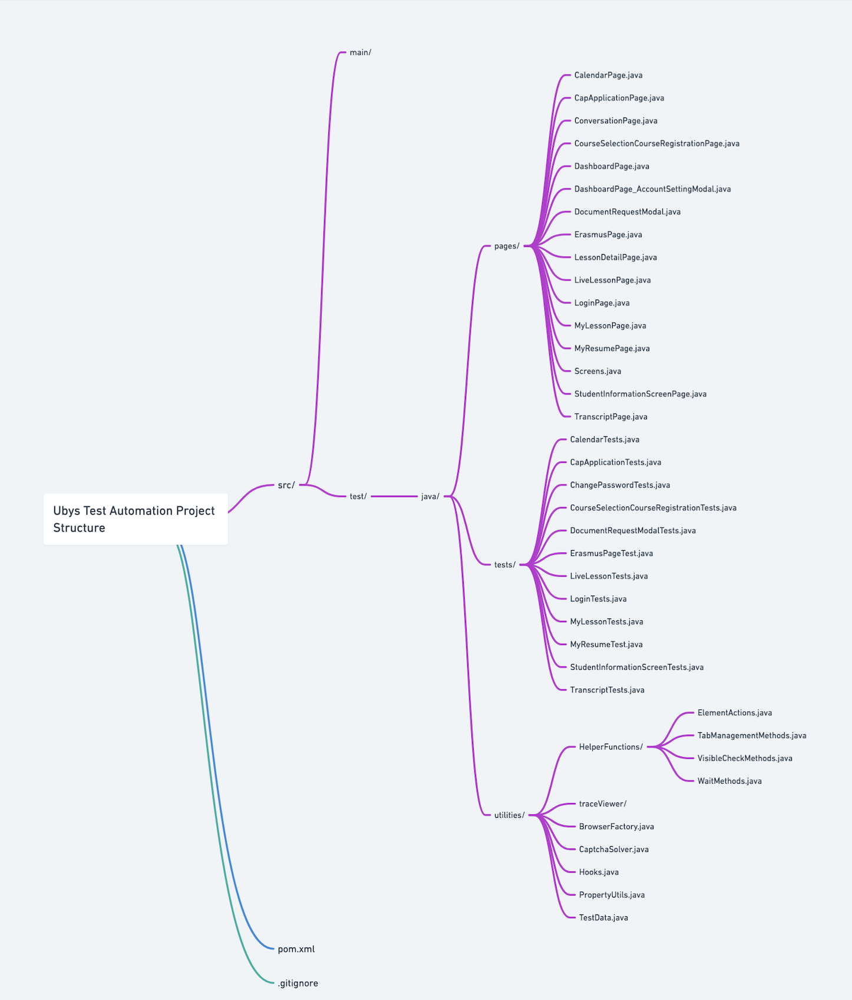

# Test Otomasyon Projesi - README (Türkçe)

## Projenin Amacı

Bu proje, bir öğrenci bilgi sistemi (Student Information System) için kapsamlı bir test otomasyonu sağlamayı amaçlamaktadır. Test senaryoları, sistemin farklı modüllerinin işlevselliğini ve kullanıcı deneyimini doğrulamak için oluşturulmuştur. Tüm testler, **Allure raporlama sistemi** ile entegre edilmiştir.

----

## Proje Yapısı

Proje, testlerin düzenli bir şekilde organize edilmesi ve okunabilirliğin artırılması için birkaç ana başlığa ayrılmıştır:

----

### 1. Test Sınıfları (Test Classes)

Her test sınıfı, belirli bir modülün veya işlevin test edilmesini sağlar. Projedeki başlıca test sınıfları şunlardır:

- **CalendarTests**: Takvim modülünün işlevselliğini doğrulayan testler.
- **CapApplicationTests**: CAP başvuru modülünün testleri.
- **ChangePasswordTests**: Şifre değiştirme sürecini kontrol eden testler.
- **CourseSelectionCourseRegistrationTests**: Ders seçim ve kayıt ekranı için test senaryoları.
- **DocumentRequestModalTests**: Belge talep ekranı testleri.
- **ErasmusPageTest**: Erasmus başvuru modülü testleri.
- **LiveLessonTests**: Canlı ders modülü ve tarih seçici gibi özelliklerin testleri.
- **LoginTests**: Giriş işlemleri için pozitif ve negatif test senaryoları.
- **MyLessonTests**: Ders detayları ve geçmiş dersler modülüne yönelik testler.
- **MyResumeTest**: Özgeçmiş oluşturma ve düzenleme modülü testleri.
- **StudentInformationScreenTests**: Öğrenci bilgi ekranındaki modüller için testler.
- **TranscriptTests**: Transkript hesaplama ve geçmiş transkriptler modülüne yönelik testler.

---
### 2. Page Class Yapısı (Page Class Structure)

Her bir ekran veya modül için ayrı bir “Page Class” oluşturulmuştur. Bu yapı sayesinde test kodu ile ekran elementleri arasında bir ayrım sağlanmıştır. Her bir Page Class, ilgili ekran veya modülün gerekli elementlerini ve bu elementler üzerinde gerçekleştirilecek işlemleri içermektedir. Aşağıda, projede kullanılan başlıca Page Class'lar ve bunlardan örnek metotlar açıklanmaktadır:

---

- **CalendarPage**: Takvim modülü için gerekli elementler ve aksiyonlar.
  - **Metotlar:**
    - `navigateToCalendar()`: Takvim ekranına yönlendirme işlemini gerçekleştirir.
    - `exportToPdf`: Takvim sayfasındaki "Export to PDF" butonunun element tanımıdır.

---

- **CapApplicationPage**: CAP başvuru ekranı için gerekli elementler ve aksiyonlar.
  - **Metotlar:**
    - `navigateToCapPage()`: CAP başvuru ekranına yönlendirme işlemini gerçekleştirir.
    - `submitCapApplication()`: CAP başvuru formunu doldurarak gönderir.

---

- **ChangePasswordPage**: Şifre değiştirme ekranı için gerekli elementler ve işlemler.
  - **Metotlar:**
    - `navigateToChangePasswordPage()`: Şifre değiştirme ekranına yönlendirme yapar.
    - `changePassword(String oldPassword, String newPassword)`: Eski şifreyi girerek yeni bir şifre oluşturur.
    - `verifyPasswordChangeSuccess()`: Şifre değişikliğinin başarılı olduğunu doğrular.

---

- **CourseSelectionPage**: Ders seçim ekranı için gerekli elementler ve işlemler.
  - **Metotlar:**
    - `navigateToCourseSelectionPage()`: Ders seçim ekranına yönlendirme yapar.
    - `selectCourse(String courseName)`: Belirtilen dersi seçer ve kaydeder.
    - `verifySelectedCourse(String courseName)`: Seçilen dersin doğru olduğunu doğrular.

---

- **DocumentRequestModalPage**: Belge talep ekranı için gerekli elementler ve işlemler.
  - **Metotlar:**
    - `openDocumentRequestModal()`: Belge talep modülünü açar.
    - `submitDocumentRequest(String documentType)`: Belirtilen belge türü için talep oluşturur.
    - `verifyRequestSuccess()`: Talebin başarıyla oluşturulduğunu doğrular.

---

- **ErasmusPage**: Erasmus başvuru ekranı için gerekli elementler ve işlemler.
  - **Metotlar:**
    - `navigateToErasmusPage()`: Erasmus ekranına yönlendirme yapar.
    - `applyForErasmus()`: Erasmus başvurusunu tamamlar.
    - `verifyApplicationSuccess()`: Başvurunun başarılı olduğunu doğrular.

---

- **LiveLessonPage**: Canlı ders ekranı için gerekli elementler ve işlemler.
  - **Metotlar:**
    - `navigateToLiveLessonPage()`: Canlı ders modülüne yönlendirme yapar.
    - `selectDate(String date)`: Belirtilen tarihi seçer.
    - `joinLiveLesson()`: Canlı derse katılım sağlar.

---

- **LoginPage**: Giriş ekranı elementleri ve işlevleri.
  - **Metotlar:**
    - `enterUsername(String username)`: Kullanıcı adını giriş alanına yazdırır.
    - `enterPassword(String password)`: Şifreyi giriş alanına yazdırır.
    - `clickLoginButton()`: Giriş butonuna tıklar.
    - `verifyLoginSuccess()`: Giriş işleminin başarılı olduğunu doğrular.
    - `verifyLoginFailure()`: Hatalı giriş işlemi sonrası hata mesajını doğrular.

---

- **MyLessonPage**: Ders detayları ve geçmiş dersler ekranı için gerekli işlemler.
  - **Metotlar:**
    - `navigateToMyLessonsPage()`: Ders detayları ekranına yönlendirme yapar.
    - `viewLessonDetails(String lessonName)`: Belirtilen dersin detaylarını gösterir.

---

- **MyResumePage**: Özgeçmiş ekranı elementleri ve işlevleri.
  - **Metotlar:**
    - `navigateToResumePage()`: Özgeçmiş ekranına yönlendirme işlemini gerçekleştirir.
    - `addNewResumeEntry(String entry)`: Yeni bir özgeçmiş girdisi ekler.
    - `deleteResumeEntry(String entryName)`: Belirtilen özgeçmiş girdisini siler.

---

- **StudentInformationScreenPage**: Öğrenci bilgi ekranı için gerekli elementler ve işlemler.
  - **Metotlar:**
    - `navigateToStudentInformationPage()`: Öğrenci bilgi ekranına yönlendirme yapar.
    - `validateModuleVisibility(String moduleName)`: Belirtilen modülün görünür olduğunu doğrular.

---

- **TranscriptPage**: Transkript modülü için gerekli elementler ve işlemler.
  - **Metotlar:**
    - `navigateToTranscriptPage()`: Transkript ekranına yönlendirme işlemini gerçekleştirir.
    - `downloadTranscript()`: Mevcut transkriptin indirilmesini sağlar.
    - `verifyTranscriptDownload()`: Transkript indirme işleminin başarılı olduğunu doğrular.

---

Bu yapı, testlerin daha modüler, yeniden kullanılabilir ve bakımının kolay hale getirilmesini sağlar. Her bir Page Class, ilgili modül veya ekran için net bir yapı sunar ve test kodunun temiz ve anlaşılır olmasını sağlar.

---

### 3. Helper Fonksiyonlar (Helper Functions)

Testlerin daha kolay yazılması ve bakımının yapılabilmesi için çeşitli yardımcı fonksiyonlar oluşturulmuştur:

- **WaitMethods**: Elementlerin yüklenmesini beklemek için kullanılır.
- **VisibleCheckMethods**: Elementlerin görünürlüğünü kontrol eder.
- **TabManagementMethods**: Sekme yönetimini kolaylaştırır (yeni sekmelere geçiş gibi).
- **ElementActions**: Elementler üzerinde işlem yapmayı kolaylaştırır (tıklama, yazma vb.).
- **TestData**: Testlerde kullanılan dinamik veri üretimi ve yönetimi sağlar.

---

### 4. Hooks (Test Başlatma ve Yönetim Mekanizması)

`Hooks` sınıfı, TestNG ile birlikte çalışan bir **test yönetim mekanizmasıdır**. Aşağıdaki işlemleri otomatik olarak gerçekleştirir:

- **Tarayıcı Başlatma ve Sayfa Hazırlığı:**
  - Test başlamadan önce tarayıcı (Chrome, Firefox vb.) başlatılır ve test edilecek URL’ye gidilir.
  - Dinamik ekran çözünürlüğü ayarları yapılır.
  - Her test için bağımsız bir tarayıcı bağlamı oluşturulur.

- **Başarısız Testlerde İzleme (Tracing):**
  - Başarısız testlerin analiz edilebilmesi için Playwright izleme dosyaları oluşturulur. Bu dosyalar, testin her adımını detaylı şekilde kaydeder.

- **Kaynak Yönetimi:**
  - Test sonrasında tarayıcı ve bağlam kapatılarak gereksiz kaynak kullanımı önlenir.
  - Eski izleme dosyaları (24 saatten eski) otomatik olarak temizlenir.

`Hooks` yapısı sayesinde testlerin yönetimi ve hata ayıklama işlemleri oldukça kolaylaştırılmıştır.

---

## Örnek Test Akışı

### **CalendarTests.validateOpeningCalendarPage**
- Takvim ekranına gidilir.
- “Export to PDF” butonunun görünür olduğu doğrulanır.

### **ChangePasswordTests.successfulChangePassword**
- Hesap ayarları ekranına gidilir.
- Geçerli bir şifre ile şifre değiştirme işlemi yapılır.
- Şifre değişikliğinin başarılı olduğu doğrulanır.

### **LoginTests.loginWithWrongUsername**
- Geçersiz bir kullanıcı adı ile giriş yapılır.
- Hata mesajının doğru şekilde göründüğü kontrol edilir.

### **ErasmusPageTest.validateErasmusApplication**
- Erasmus başvuru ekranına gidilir.
- Başvuru formunun doldurulabilir olduğu doğrulanır.
- Form doldurulduktan sonra başvurunun başarılı olduğu kontrol edilir.

### **MyResumeTest.addResumeDetails**
- Özgeçmiş ekranına gidilir.
- Yeni bir özgeçmiş kaydı eklenir.
- Kaydedilen özgeçmişin doğru şekilde görüntülendiği doğrulanır.

### **DocumentRequestModalTests.requestTranscriptDocument**
- Belge talep ekranına gidilir.
- Transkript belgesi talep edilir.
- Talep edilen belgenin doğru şekilde listeye eklendiği doğrulanır.

---

Bu doküman, projenin genel yapısını ve işleyişini detaylı şekilde açıklamaktadır. Testlerin nasıl çalıştırılacağını ve projede kullanılan teknolojileri öğrenmek isteyen herkes için rehber niteliğindedir. 🚀
